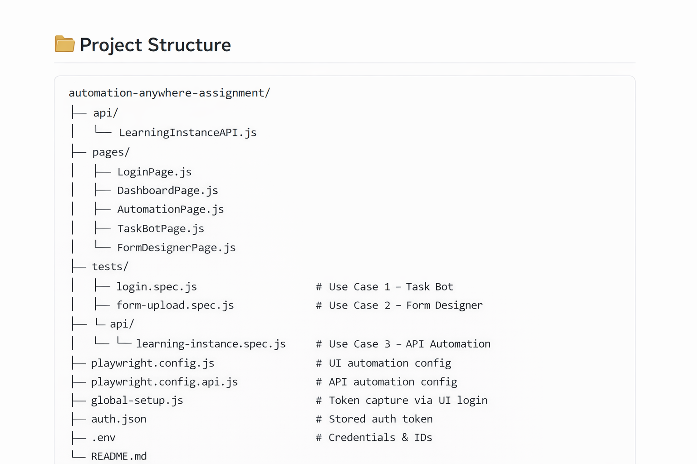
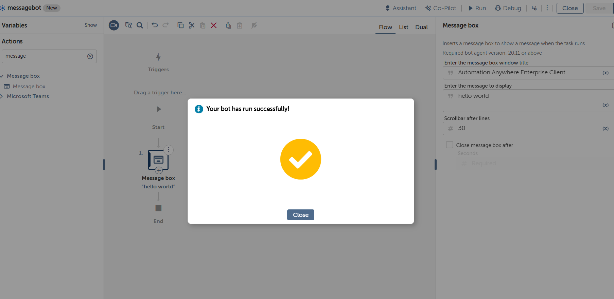
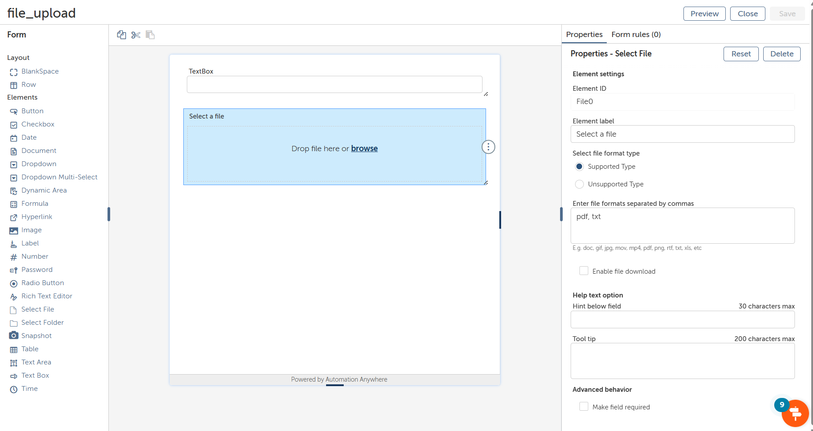
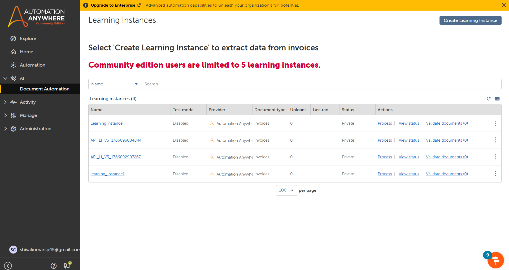

# Automation Anywhere – UI & API Automation Assignment

---

## Playwright Automation Framework

---

### 📌 Project Overview

This project demonstrates **end-to-end automation** for **Automation Anywhere Community Edition** using **Playwright**.

The automation covers:

- UI Automation (Task Bot – Message Box)
- UI Automation (Form Designer – Design Time)
- API Automation (Learning Instance Creation)
- Secure token-based authentication handling
- Enterprise-grade test structure and reporting

---

## 🧩 Technologies Used

- **Playwright (JavaScript)**
- **Node.js**
- **Automation Anywhere – Community Edition**
- **REST APIs**
- **dotenv (Environment Variables)**
- **Playwright HTML Reporter**

---

  

---

## 🧪 Use Case 1 – Task Bot Automation (Message Box)

---

### 🎯 Objective

Automate the creation of a **Task Bot** and configure a **Message Box** action using Automation Anywhere UI.

---

### 🔄 Steps Automated

- Launch Automation Anywhere Community Edition portal
- Login using valid credentials
- Navigate to **Automation → Create**
- Select **Task Bot**
- Enter Task Bot name
- Add **Message Box** action
- Configure:
  - Message Title
  - Message Content
- Save the Task Bot

---

### ✅ Validations Performed

- Task Bot is created successfully
- Message Box configuration is saved
- Bot persists after page refresh

---

## 🧪 Use Case 2 – Form Designer Automation (Design Time)

---

### 🎯 Objective

Automate **Form creation and configuration** using **Form Designer** in Automation Anywhere.

> ⚠️ This use case focuses strictly on **design-time automation**.

---

### 🔄 Steps Automated

- Login to Automation Anywhere
- Navigate to **Automation → Create → Form**
- Open **Form Designer**
- Drag and drop:
  - **Text Box**
  - **Select File**
- Configure element properties:
  - Labels
  - File formats
- Save the form
- Verify form persistence

---

### ✅ What Is Covered

- Drag & Drop interactions
- Canvas validation
- Properties panel configuration
- Save operation verification
- Form persistence after reload

---

### ⚠️ Limitation – File Upload Execution

Forms in Automation Anywhere are executed **only at runtime** via **Task Bots** using the **Display Form** action.

Important clarifications:

- **Preview** is a design-time feature only
- Preview is used for:
  - Layout alignment
  - Positioning
  - Screen size adjustments
- Uploaded files in Preview:
  - Are NOT persisted
  - Are NOT submitted
- Playwright automates browser UI only
- Bot runtime execution is outside browser scope

✔ Therefore, **actual file upload execution is intentionally NOT demonstrated**

✔ This aligns with Automation Anywhere platform behavior and enterprise automation best practices

---

## 🧪 Use Case 3 – Learning Instance Creation (API Automation)

---

### 🎯 Objective

Create a **Learning Instance** using **Automation Anywhere REST APIs**.

---

### 🔗 API Endpoint Used

POST /cognitive/v3/learninginstances

---

### 🔄 Steps Automated

- Login performed once via UI automation
- Authentication token intercepted from network requests
- Token stored securely in `auth.json`
- Token reused in API test
- Learning Instance created via API

---

### ✅ Validations Performed

- HTTP Status Code: **200 / 201**
- Response time within acceptable threshold
- Response schema validation:
  - `id`
  - `name`
  - `status`
- Functional validation of instance name

---

## 🔐 Authentication Strategy

---

- UI login executed once using Playwright
- Authentication token captured from network traffic
- Token stored in `auth.json`
- Token reused for API automation

✔ No hardcoded credentials  
✔ No repeated login  
✔ Secure and scalable approach  

---

## ⚙️ Environment Setup

---

## 📸 Screenshots

### 🔐 Login & Dashboard

---

### 🤖 Use Case 1 – Task Bot (Message Box)

---

### 📝 Use Case 2 – Form Designer

---

### 🔌 Use Case 3 – API Automation

### 📦 Install Dependencies

npm install

### 🔑 Configure Environment Variables (`.env`)

AA_USERNAME=your_email
AA_PASSWORD=your_password
DOMAIN_ID=xxxx
DOMAIN_LANGUAGE_ID=xxxx
DOMAIN_LANGUAGE_PROVIDER_ID=xxxx

---

## ▶️ Execution Commands

---

### Run All UI Tests

npx playwright test

---

### Run Task Bot Automation Only

npx playwright test tests/login.spec.js

### Run Form Designer Automation Only

npx playwright test tests/form-upload.spec.js

### Run API Automation Only

npx playwright test tests/api/learning-instance.spec.js --config=playwright.config.api.js

---

## 📊 Reporting

---

Playwright generates an **HTML report** automatically after execution.

npx playwright show-report

---

## 📸 Screenshots & Artifacts

---

Screenshots are captured automatically on:

- Test failures
- Assertion errors
- Timeout issues

📁 Location:

test-results/

---

## 🏁 Conclusion

---

This project demonstrates **professional-grade automation** aligned with **Automation Anywhere enterprise architecture**.

- Clean Page Object Model (POM)
- Secure token handling
- Honest platform limitation documentation
- Stable, maintainable, scalable framework

✔ Production-ready  
✔ Enterprise-compliant  
✔ Technically accurate  
